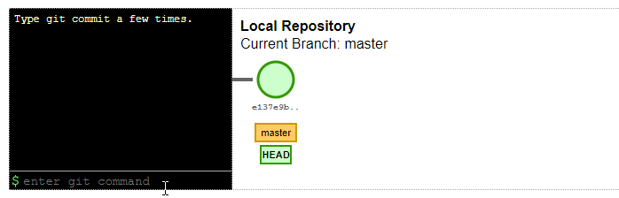
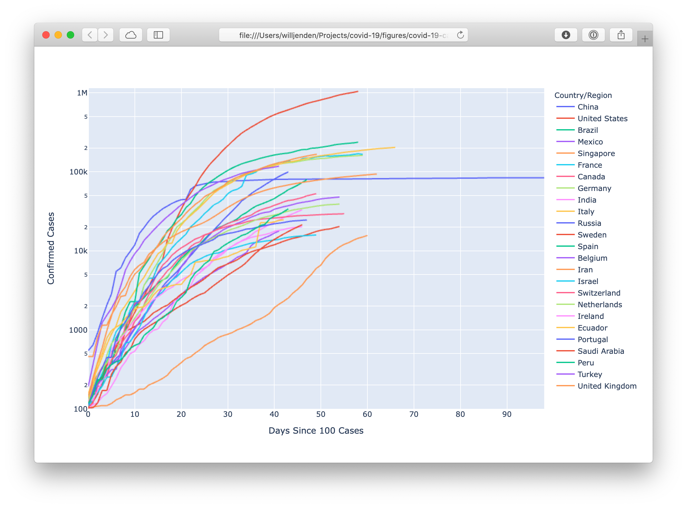
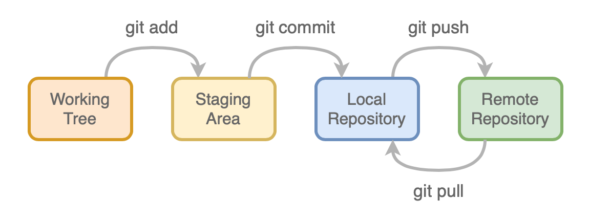
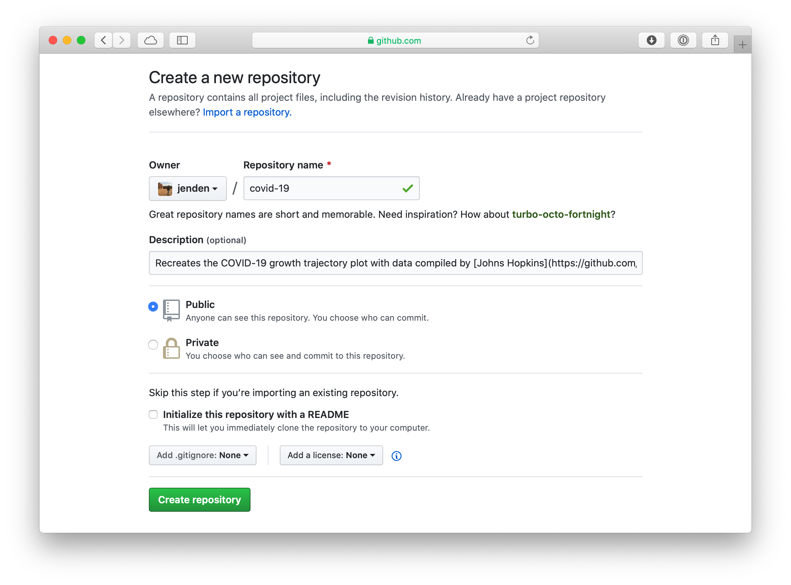
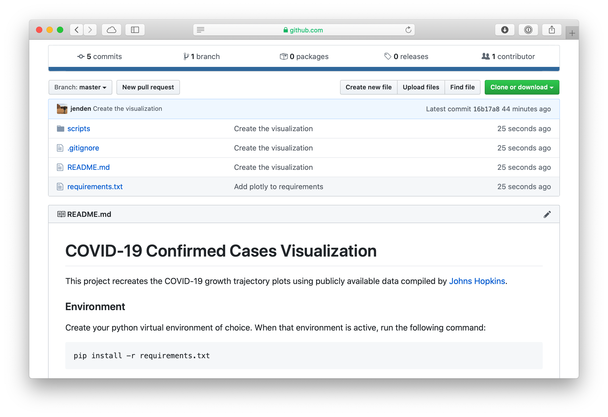
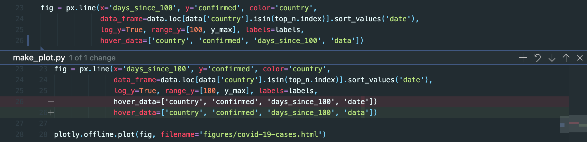
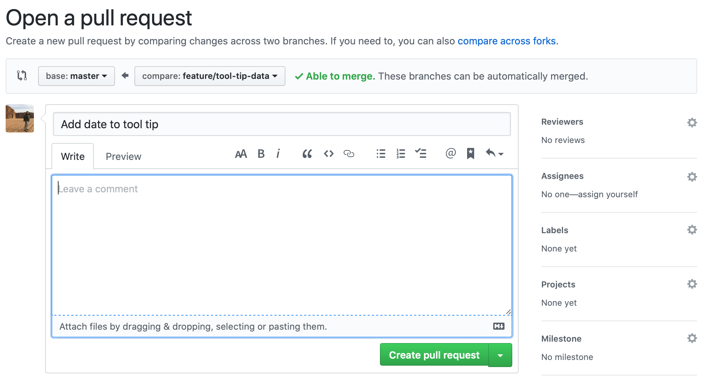
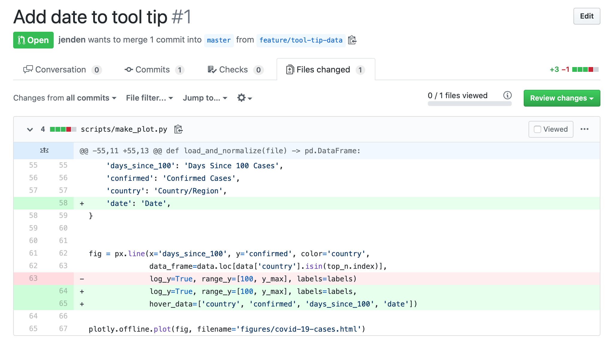
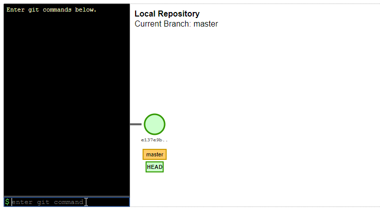

# An Intro to Git

We're going to create a plot of the Covid-19 cases around the world using publicly available data compiled by [Johns Hopkins](https://github.com/CSSEGISandData). We'll write a script we can use to update the data, create a visualization and then practice contributing improvements with a pull request.

[](https://www.ft.com/content/ff3affea-63c7-11ea-b3f3-fe4680ea68b5)


## But first, what is Git?

Git is a distributed version control system. It's software to help track and manage source code, which means it works with any kind of text files. It was developed by [Linus Torvalds](https://en.wikipedia.org/wiki/Linus_Torvalds) (the creator of Linux) to manage the Linux kernel. The software is open source and freely distributed.

* Keep a canonical working version
* Easily restore or reset changes that break your code
* Separate valid code from new code and functionality 
* Collaborate with others on the same files

Git is not a panacea and there are many ways to tie yourself up in knots. However, it can reinforce good habits and help save you from yourself. Plus, if you want to work in software, basic familiarity is a job requirement.

I choose to start managing my code and documentation with Git when an idea passes the boundary from exploration of a concept into a project with identifiable deliverables such as code, figures, analysis. My usual workflow is to start with a notebook, understand what I'm building and then start creating re-usable scripts and modules that I commit to a git repository. That's what we're going to do today.


### Git vs. GitHub

**Git** is the tool you run on your computer to manage local repositories. **GitHub** is a service that hosts remote git repositories (like this one) so you can share your code and collaborate with others. Git can be used locally but GitHub lets users keep a secure, canonical copy in the cloud and give others access as needed. 

GitHub repositories can be **public** (like [Git itself](https://github.com/git/git), [Python](https://github.com/python/cpython), various [BC Government Projects](https://github.com/bcgov)) or **private** (users include the [US Dept of Defense](https://github.com/deptofdefense), [Microsoft](https://github.com/Microsoft), and [UBC](https://github.com/ubc-library)). While there are other services (I like [GitLab](https://about.gitlab.com)), GitHub is the defacto standard in the industry so we're going to use it for this tutorial.

  


## Create a Repository

Git projects are called repositories. A repository starts as just a folder on your computer.  We'll use Git to initialize the repository and add files. 


> We're going to use the terminal to do this, so prepare yourself. I'll use `$` to denote the bash prompt (although yours may be `>`  or `%` or something else entirely) and `# <a comment>` to add additional context. The output  of commands will not have any symbol.


Open a terminal window. You can do this in a stand-alone terminal window (Terminal on Mac, git-bash on Windows), or with the integrated terminal in VS Code (Terminal menu > New Terminal). 


> If you're using VS Code on Windows, you will likely need to tell it to use Git Bash and not CMD or PowerShell. See [this stack overflow](https://stackoverflow.com/questions/42606837/how-do-i-use-bash-on-windows-from-the-visual-studio-code-integrated-terminal) for a quick overview of how to change it.


Now you can navigate to the directory where you want to save your code using `cd` and create a new folder for this project. For me that is `/Users/willjenden/Projects`. Most shells will let you access your user directory with the `~` so navigating to  `~/Projects` gets me to the same place.

```bash
$ # print the current directory (i.e. folder) 
$ pwd  
/Users/willjenden/Projects
$ # create a new directory
$ mkdir covid-19
$ # change directories into the new directory. 
$ cd covid-19
$ pwd
/Users/willjenden/Projects/covid-19
$ # list the contents of the directory
$ ls
```


We now have a new directory with nothing in it. It's not even a Git repository yet. In order to make it a Git repository we need to run `git init` from the directory. You can do this at any time in any folder (that's not a child of another Git repository) not just an empty one.

```bash
$ git init
Initialized empty Git repository in /Users/willjenden/Projects/covid-19/.git/
$ ls
```


And we have a repository. It's empty, but now it's an empty Git repository. If you execute `ls -a` (list all) then should see a `.git` folder. This is where Git keeps track of your repository. As a general rule of thumb, you don't need to go in here so just let Git do it's thing.


> Note: Along with `.git`, you should have seen two other entires: `.` and `..`.  `.` is a reference to the current directory and `..` is a reference to the parent directory. You can try navigating around with different combinations of `.` and `..` like `cd ..` will bring you to `Projects` and `cd covid-19/../` will take you on trip into the covid directory and then back out.


### User Credentials

When you use Git, your name and email are stored with each contribution. Double check that your user name and email address are registered with Git. You can check this by running

```bash
$ git config user.name
jenden
$ git config user.email
me@example.com
```

If you don't see any output, you can set these values for all repositories on your computer with the following commands. Just substitute with your username and email address. If you've created an account with GitHub, you can use the username and email you created there.

```bash
$ git config user.name <my-username>
$ git config user.email <my-email@example.com>
```


### Add a file

Let's create a README in our repository. A README is a text document (usually in Markdown) that provides new users (and sometimes, yourself in six months) an introduction to the project. It should explain the purpose of the project, how to set up the development environment and links to other useful information, either in the repository or externally. As a bonus, the README will effectively become the cover page of your repository on GitHub.

I'm not going to make you write files from command line, so let's open an editor in this folder. I'm using Visual Studio Code so I can run `code .` to open the current directory (`.`) in VSCode.

```bash
$ code .
```


 You should see something like this:


You'll see a folder on the left side, and not much else. Go back to your terminal and type `touch README.md`. You should now see a file called *README.md* in the left panel. Open it up and let's start our file.

```markdown
# COVID-19 Confirmed Cases Visualization

This project recreates the COVID-19 growth trajectory plots using publicly available data
compiled by [Johns Hopkins](https://github.com/CSSEGISandData).
```


>  By the way, this syntax (and the *\*.md* file extension) is markdown. It's lightweight and meant to be readable as plain text or quickly formatted and styled for display on the Web. I highly recommend getting comfortable with [GitHub flavored markdown](https://guides.github.com/features/mastering-markdown/) for writing documents in version control.


Now we're finally going to start using Git. From the terminal let's look at our changes, add the file to the staging area and then commit it to the repository. 

```bash
$ git status
On branch master

No commits yet

Untracked files:
  (use "git add <file>..." to include in what will be committed)
        README.md

nothing added to commit but untracked files present (use "git add" to track)
```


We use  `git status` to tell us what's going in the repo and it often gives us useful hints about what we should do next. The important take away here is that we have "untracked" files. Untracked files are files that exist in the Git repository (the top level directory or any child directory) but are not yet managed by Git. We can tell Git to start tracking a file with the `git add <file>` command.

```bash
$ git add README.md
$ git status
On branch master

No commits yet

Changes to be committed:
  (use "git rm --cached <file>..." to unstage)
        new file:   README.md
```


The *README.md* file is now in the staging area for our repository with a note that says it's a new file. For Git to create an indelible copy of the file with it's current contents, we need to create a "commit". A commit is the immutable, atomic unit of Git and the state of the repository is built up from a graph of related commits. 

```bash
$ git commit -m "Add README"
[master (root-commit) 116767f] Add README
 1 file changed, 3 insertions(+)
 create mode 100644 README.md
```


Now our repository has a single commit which contains the small README we just wrote, our name as author and a helpful message to remind us why we made the commit. 


Commits are identified by a hash which is cryptographically determined by the contents of the commit. If any of the contents change, even by a single bit, we would get a different hash. This 40-digit alpha-numeric number is often abbreviated to the first 8 digits. We can check the history of commits and see the full log with the `git log` comand.

```bash
$ git log
commit 116767f52e0caddd8505b2f8becf247988ad076e (HEAD -> master)
Author: jenden <me@example.com>
Date:   Wed Apr 29 22:06:27 2020 -0700

    Add README
```


### Get some data

Let's make this repository do something useful. I've created a script to pull the daily COVID-19 data curated by Johns Hopkins. Create a new directory called `scripts` in your repository and then add the [`update_data.py`](scripts/update_data.py) script to the directory. 

This script requires a python environment with `pandas` and `requests` packages. You can create a requirements file to specify the dependencies for anyone who wants to use this code in the future.

```
# requirements.txt
requests
pandas
```

Now let's create a virtual environment, install our requirements and run our `update_data.py` script so we can start to visualize the data!

```bash
$ # create a python virtualenv, activate it and install requirements
$ virtualenv env
$ source env/bin/activate
$ pip install -r requirements.txt
```


> Alternatively, you could create a conda environment. I generally prefere these environments, but they don't create a folder we need to ignore so it's not as useful for this demo. Install a conda environment using python 3.8 and the dependencies in requirements.txt like this.
>
> ```bash
> $ conda create --name covid-19 python=3.8 --file requirements.txt
> $ conda activate covid-19
> ```
>
> Once you activate the environment, your shell should contain the active environment in the prompt (although it probably won't look quite like this)
>
> ```bash
> (covid-19) $
> ```


Once your python environment is active and you have the dependencies installed, create directories for the data and run the script to download each day and compile into a single file.

```bash
$ # make directories for the data
$ # -p option tells mkdir to create *p*arent directories
$ mkdir -p data/raw data/processed
$ python scripts/update_data.py --end 2020-06-30
INFO:root:Downloading data for 2020-01-22 - 2020-06-30 to /Users/willjenden/Projects/covid-19/data/raw
INFO:root:01-22-2020 -- downloading file: https://raw.githubusercontent.com/CSSEGISandData/COVID-19/master/csse_covid_19_data/csse_covid_19_daily_reports/01-22-2020.csv
INFO:root:01-22-2020 -- saved to /Users/willjenden/Projects/covid-19/data/raw/01-22-2020.csvINFO:scripts/update_data.py:04-25-2020 -- downloading file: https://raw.githubusercontent.com/CSSEGISandData/COVID-19/master/csse_covid_19_data/csse_covid_19_daily_reports/04-25-2020.csv
...
INFO:root:Read 06-30-2020.csv
INFO:root:Loaded 22632 records over period from 2020-01-22 00:00:00 to 2020-06-30 00:00:00
INFO:root:Sample rows
          date                   country  confirmed   deaths
155 2020-04-10                   Somalia       21.0      1.0
125 2020-06-17                 Nicaragua     1823.0     64.0
166 2020-04-03               Timor-Leste        1.0      0.0
23  2020-06-21                    Brazil  1085038.0  50617.0
31  2020-03-20                     Chile      434.0      0.0
INFO:root:Combined dataset written to /Users/willjenden/Projects/covid-19/data/processed/covid19-daily.csv
```

Hopefully that all went smoothly. If the script failed, check that you created and specified the right data directory beforehand and that the URL for the CSV files hasn't changed. A copy of the data file is included in this repository, so feel free to download [`data/processed/covid19-daily.csv`](data/processed/covid19-daily.csv) so you can move on with the demo.


### Update documentation

To remember how to run this script next time we want to update data, we'll need to tell our future selves (and other users) how to set up a python environment and how to run the script. The README is the obvious place to document this. 

> A quick aside. Documentation is hard to get right. If we carefully document every bit of our script (or comment it for that matter), it's very easy for it to get out of sync with what the code actually does. Our goal is to strike a balance to let people know what to do but not to create technical debt for ourselves in the future with stacks of documentation we need to update every time we modify the code. And, like many things, there are diminishing returns to our efforts. A little, well-maintained documentation goes a long way.


Add the following sections to the README file.

```markdown
### Environment

Create your python virtual environment of choice. When that environment is active, 
run the following command:

​```bash
pip install -r requirements.txt
​```

### Data

The Center for Systems Science and Engineering at Johns Hopkins maintains daily summary 
of Coronavirus data around the world in a [GitHub repository](https://github.com/CSSEGISandData/COVID-19/tree/master/csse_covid_19_data/csse_covid_19_daily_reports). 
Run the `update_data.py`script to update the data. The command below will download the
data from Jan 22 to April 25 and save it in the `data/` folder of this directory.

​```bash
python scripts/update_data.py --end 2020-04-25
​```
```


### Commit changes

We just created a bunch of new files in our repository. Check the status and you can see the new files and directories we just created.

```bash
$ git status
On branch master
Changes not staged for commit:
  (use "git add <file>..." to update what will be committed)
  (use "git restore <file>..." to discard changes in working directory)
        modified:   README.md

Untracked files:
  (use "git add <file>..." to include in what will be committed)
        data/
        env/
        requirements.txt
        scripts/

no changes added to commit (use "git add" and/or "git commit -a")
```


This is more complicated than before. We have untracked files *requirements.txt*, untracked directories *data/*, *env/* and *scripts/* and modified *README.md*. 

Now is a good time to talk about the life cycle of Git files. All files we create start out as "untracked" in our working tree. When we use `git add` we checkpoint the current contents of the file in the "staging area". Then when we are happy with the changes we've staged, we can create a permanent record of those changes by creating a commit.


Let's tell Git that we want to stage the changes to *README.md* and start tracking *requirements.txt* and the *scripts/* directory. 

```bash
$ git add requirements.txt scripts/ README.md
$ git status
On branch master
Changes to be committed:
  (use "git restore --staged <file>..." to unstage)
	modified:   README.md
	new file:   requirements.txt
	new file:   scripts/update_data.py

Untracked files:
  (use "git add <file>..." to include in what will be committed)
	data/
	env/
```


Git now indicates that three changes are staged for commit including the new files *requirements.txt* and *scripts/update_data.py*. We can now make a commit and permanently incorporate those changes.

```bash
$ git commit -m "Add data update script and environment requirements"
[master 4c98ca2] Add data update script and environment requirements
 3 files changed, 169 insertions(+)
 create mode 100644 requirements.txt
 create mode 100644 scripts/update_data.py
```


### Ignore changes

Unlike the other files, the *env* directory is specific to our local machine and shouldn't be contributed to the repository because anyone who clones the repository will recreate their own environment. Likewise, the contents of *data* doesn't need to be version controlled because it can be downloaded from the source at any point in time. In general, it's good practice to keep data out of version control and separate from the code to process it. Luckily it's easy to tell Git to ignore files with a [`.gitignore`](https://help.github.com/en/github/using-git/ignoring-files) file. Create a file in the root directory and put in the following contents:

```
# .gitignore
.vscode  # VS Code saves configuration settings here
env/
data/

```


Now try checking the status of the repository again. You can use `ls` to confirm that the directories still exist but that Git is ignoring them. Now commit the contents of the *.gitignore* file and let's continue.

```bash
$ git status
On branch master
Untracked files:
  (use "git add <file>..." to include in what will be committed)
        .gitignore

nothing added to commit but untracked files present (use "git add" to track)
$ ls
README.md
data
env
requirements.txt
scripts
$ git add .gitignore
$ git commit -m "Create gitignore"
```


### Under the hood

You may have noticed that every time we get the status or make commits, Git tells us something about being on "branch master". This raises two questions: what's a branch, and what's master?

Under the hood, a Git repository is a graph of commits. So far our repository is just a linear network of commits where each new commit references the previous commit. We refer to this history of commits as a branch.

Master is the name given, by convention, to the main or default branch. It represents a label or "tag" which points to one commit. Every time we make a new commit to the master branch what we're really doing is creating a commit with a parent of the current master branch and then reassigning the master label to this new commit. 

This animation shows how each new commit points to the previous commit and the master label moves to the new commit. 




This animation also introduces the concept of the HEAD. The HEAD refers to the last commit in the current branch. When we checkout a new branch, our HEAD will move to the last commit on that branch.

These animations were created with the excellent [Explain Git](https://onlywei.github.io/explain-git-with-d3/#commit). If you want to dive deeper and understand how Git works under the hood, I strongly recommend exploring this site.

Okay, back to creating our plot.


### Create the plot!

Now we have our data, we're ready to visualize the data and save a plot. We'll use [plotly express](https://plotly.com/python/plotly-express/) so we'll need to add `plotly` to the *requirements.txt* file. If you check the status of the repository you'll see a modified file. We can check what's been modified by running `git diff`.

```bash
$ git diff
diff --git a/requirements.txt b/requirements.txt
index 69de461..70c3d32 100644
--- a/requirements.txt
+++ b/requirements.txt
@@ -1,2 +1,3 @@
 pandas
 requests
+plotly
```


There's a lot of output here, but the critical pieces are the lines with that are prefixed with a + symbol, indicating a new line or a – symbol indicating removed line. In this case, we've only added one line so the diff is very simple. Commit the change with an appropriate message and then install the new dependency in your local environment.

```bash
$ git commit -am "Add plotly to requirements.txt"
[master 797ea93] Add plotly to requirements.txt
 1 file changed, 1 insertion(+)
$ pip install -r requirements.txt
```


Let's add the [`make_plot.py`](scripts/make_plot.py) to out scripts directory. This script is hard-coded to perform the following steps:

* read the `data/processed/covid19-daily.csv` file as a Pandas DataFrame
* count days since the 100th case 
* plot the confirmed number of cases by country on a log scale against days since the 100th case
* save the plot to the *figures* directory


```python
# make_plot.py
import pandas as pd
import plotly
import plotly.express as px

data = pd.read_csv('data/processed/covid19-daily.csv')

data['days_since_100'] = data[data['confirmed'] > 100] \
        .sort_values('date') \
        .groupby('country') \
        .cumcount()

top_n = data.groupby('country')['confirmed'].max().sort_values(ascending=False).head(25)

y_max = max(data['confirmed']) * 1.1

labels = {
    'days_since_100': 'Days Since 100 Cases',
    'confirmed': 'Confirmed Cases',
    'country': 'Country/Region',
    'date': 'Date'
}

fig = px.line(x='days_since_100', y='confirmed', color='country', 
              data_frame=data.loc[data['country'].isin(top_n.index)].sort_values('date'),
              log_y=True, range_y=[100, y_max], labels=labels)

plotly.offline.plot(fig, filename='figures/covid-19-cases.html')
```


Now add a bit of a description to the README to explain how to create the visualization.

```markdown
### Visualization

Once the data is downloaded, run the `make_plot.py` script to create an interactive 
plot of the confirmed cases by country. 

​```bash
mkdir figures
python scripts/make_plot.py
​```
```


Try running the script per the README instructions. You should see something like this open in your browser.



Okay, let's check what this has done to our repository.

```bash
$ git status
On branch master
Changes not staged for commit:
  (use "git add <file>..." to update what will be committed)
  (use "git restore <file>..." to discard changes in working directory)
        modified:   README.md

Untracked files:
  (use "git add <file>..." to include in what will be committed)
        figures/
        scripts/make_plot.py

no changes added to commit (use "git add" and/or "git commit -a")
```


That looks about right. Let's clean up our working tree by staging the changes to the README, adding the script and adding `figures/` to the *.gitignore*.

```bash
# append "figures/" to the end of the .gitignore file
$ echo "figures/" >> .gitignore
$ git add README.md scripts/ .gitignore
$ git status
On branch master
Changes to be committed:
  (use "git restore --staged <file>..." to unstage)
        modified:   .gitignore
        modified:   README.md
        new file:   scripts/make_plot.py

```


Now that these changes are staged and ready to be committed. Our working tree is clean (we can verify by running `git diff` which will not indicate any changes). If we want to see the changes that are staged, we need to tell Git to look at the staged files with `git diff --staged`. This will create a lot of of output. If you want to look at a single file, you can pass the filename as the last argument.

```bash
$ git diff --staged .gitignore
diff --git a/.gitignore b/.gitignore
index 48656a6..923db9e 100644
--- a/.gitignore
+++ b/.gitignore
@@ -1,3 +1,4 @@
 .vscode/
 env/
 data/
+figures/
```

> Note: When there are more changes than can fit on the screen, you can scroll up and down using the ⬆️ and ⬇️ arrow keys or `j` and `k` (so you don't need to move your hands from the home row). Exit by pressing `q`.


Commit your changes with an appropriate commit message and then let's push a copy of our entire repository up to GitHub.


## Remote repository on GitHub

So far we've been grouping our file changes into commits, and adding commits into our local repository. Now we're ready to start synchronizing our commits with a remote repository. 



Login to your account on [GitHub](https://github.com/login). Look for the green "new" button and create a repository. Give it a reasonable name a short description. You can choose to make it private (only you can see it) or public. 



Once created, you'll see the main page which lists a number of options for how to get started with your repository. We're looking to "push an existing repository" because we have an existing local repository and we want to "push" the commits to the new GitHub remote repository we've just created. Before you copy and run the commands, let's take a look at what they do.

The `git remote` command manages references to other repositories. We're going to create a reference to our Git remote repository and give it the shorthand name `origin` by convention. This makes more sense when you think that you often get a copy of someone else's repository in which case "origin" refers to the place where your copy originated.


> Note: There are two ways to authenticate with Git. The recommended method is by using an SSH key and a url that looks like `git@github.com:<username>/<repository>.git` but this requires a bit of initial set up. You can also use the url that looks like `https://github.com/<username>/<respository>.git`  and authenticate with your GitHub username and password when prompted. Git will know what to do depending on which url you give it.


The `git push` command pushes the set of commits in your local repository to a remote repository. The `-u` flag is necessary for the first commit to a new branch and tells Git that our local branch should be linked with the `master` branch on the remote repository.

Now let's give it a shot.

```bash
$ git remote add origin https://github.com/jenden/covid-19.git
$ git push -u origin master
Enumerating objects: 27, done.
Counting objects: 100% (27/27), done.
Delta compression using up to 4 threads
Compressing objects: 100% (19/19), done.
Writing objects: 100% (27/27), 4.46 KiB | 1.11 MiB/s, done.
Total 27 (delta 6), reused 0 (delta 0)
remote: Resolving deltas: 100% (6/6), done.
To https://github.com/jenden/covid-19.git
 * [new branch]      master -> master
Branch 'master' set up to track remote branch 'master' from 'origin'.
```


Congratulations! You've just pushed your first commits up to a GitHub repo. Let's go check it out what it looks like on the GitHub website.



You can see that all the commits we made on our local machine now show up here. Also, none of the files we excluded from the repository like *data* or *env* have been pushed to the remote repository.


## Add a new feature

It's been bothering me that the tool tip displayed when hovering over our data points doesn't show the date. It shows the variables on the plot, but because the scale is aligned to days since the 100th case, the dates aren't apparent. We can fix this.


> If you're able, you can work with a partner in the class and contribute to their repository. This is much more like the situation in real life. You'll need to add each other as collaborators to each others repositories. You can do this by going to Settings > Manage Access > Invite Collaborator. Now you can "clone" a copy of your partner's repository and push changes to their repository.
>
> Move up a directory so you are no longer in your own Git repository. Then run the `git clone` command and give it the URL of your partner's repository and a folder name to store the project on your machine. 
>
> ```bash
> $ cd ..
> $ git clone <my-partners-project-url.git> my-partner-covid-19
> Cloning into 'my-partner-covid-19'...
> remote: Enumerating objects: 22, done.
> remote: Counting objects: 100% (22/22), done.
> remote: Compressing objects: 100% (13/13), done.
> remote: Total 22 (delta 3), reused 19 (delta 2), pack-reused 0
> Unpacking objects: 100% (22/22), done.
> ```
>
> 
>
> If you list `ls` the contents of this directory, you should see a new folder called *my-partner-covid-19*. Change directories with `cd my-partner-covid-19` and you will see some familiar contents. We're now ready to start contributing new code to someone else's repository.  


### Create a branch

While you can do all your work on the *master* branch, if good practice to separate changes onto new branches, make sure they are working and then "merge" the changes back into the *master* branch. This is especially true when working on someone else's repository. In fact, we'll not only create a new branch, but we'll create a "pull request" on GitHub which tells our partner what we did, let's them see the changes, and gives them the control to merge our changes only when they're ready.

Create a new branch with the `git branch` command and then list the branches we have defined 

```bash
$ git branch feature/tool-tip-date 
$ git branch 
  feature/tool-tip-date
* master
```


You'll see our two branches and *master* marked with an asterisk because it's currently checked out. Even though we created a branch, any commits we make now will be made to the master branch. To contribute to our branch, you need to run the `git checkout` command. 

```bash
$ git checkout feauture/tool-tip-date
Switched to branch 'feature/tool-tip-date'
$ git branch
* feature/tool-tip-date
  master
$ git status
On branch feature/tool-tip-date
nothing to commit, working tree clean
```


Now let's make the changes. I'm going to add the `hover_data` argument to the plot function and pass a list of the fields that should show up in the tool tip. This list references the name of the column in the data frame, so I'm also going to update the labels dictionary so that "date" becomes "Date". Here's the relevant section of `make_plot.py` with the new additions.

```python
labels = {
    'days_since_100': 'Days Since 100 Cases',
    'confirmed': 'Confirmed Cases',
    'country': 'Country/Region',
    'date': 'Date',
}

fig = px.line(x='days_since_100', y='confirmed', color='country', 
              data_frame=data.loc[data['country'].isin(top_n.index)], 
              log_y=True, range_y=[100, y_max], labels=labels, 
              hover_data=['country', 'confirmed', 'days_since_100', 'date'])
```


Let's use `git diff` to confirm that these changes exist. 

```bash
$ git diff
diff --git a/scripts/make_plot.py b/scripts/make_plot.py
index c141358..c6d0536 100644
--- a/scripts/make_plot.py
+++ b/scripts/make_plot.py
@@ -55,11 +55,13 @@ labels = {
     'days_since_100': 'Days Since 100 Cases',
     'confirmed': 'Confirmed Cases',
     'country': 'Country/Region',
+    'date': 'Date',
 }
 
 fig = px.line(x='days_since_100', y='confirmed', color='country', 
               data_frame=data.loc[data['country'].isin(top_n.index)], 
-              log_y=True, range_y=[100, y_max], labels=labels)
+              log_y=True, range_y=[100, y_max], labels=labels, 
+              hover_data=['country', 'confirmed', 'days_since_100', 'date'])
 
 plotly.offline.plot(fig, filename='figures/covid-19-cases.html')
```


Run the script to ensure the plot generates properly and works as expected. Then commit the changes to your branch and push to the remote repository. Note that you'll need to use the `-u` flag to set the upstream branch because the remote repository doesn't yet have a *feature/tool-tip-date* branch. Don't worry if you forget through, Git will remind you.

```bash
$ git add scripts/make_plot.py                                                                     (covid-19) 
$ git commit -m "Add date to tool tip" 
$ git push -u origin feature/tool-tip-date
```


### Whoops!

This is where Git is great. Let's say you're making changes and whatever you were attempting doesn't work out. This happens all the time to me. Or maybe you made an accidental key stroke in a file which is breaking things without realizing it.

At any point you can check your repository to see what has changed. In this case, I made a change in *make_plot.py* which would cause the tooltip to fail.

```bash
$ git status
diff --git a/scripts/make_plot.py b/scripts/make_plot.py
index 021ede9..3ea5ff6 100644
--- a/scripts/make_plot.py
+++ b/scripts/make_plot.py
@@ -23,6 +23,6 @@ labels = {
 fig = px.line(x='days_since_100', y='confirmed', color='country', 
               data_frame=data.loc[data['country'].isin(top_n.index)].sort_values('date'),
               log_y=True, range_y=[100, y_max], labels=labels,
-              hover_data=['country', 'confirmed', 'days_since_100', 'date'])
+              hover_data=['country', 'confirmed', 'days_since_100', 'data'])
 
 plotly.offline.plot(fig, filename='figures/covid-19-cases.html')
```


It's easy to revert that change by telling git to checkout the last version of this file. 

```bash
$ git checkout -- scripts/make_plot.py
$ git diff
# empty!
```


Better yet, many text editors and IDEs have Git integrations built in which will highlight the change and give you an option to revert that single line.




Now we can go to GitHub and create a pull request to merge the changes back into master.


## Pull requests

When you want to merge one branch into another (usually a feature branch into the main master branch), the best practice is to open a pull request on the server that states what changes were made. This request is submitted to the owner of repository so they can "pull" the changes you've created into their code.

From your repo on GitHub, you should see a prompt for a new pull request. This is usually populate from the latest branch you pushed, but if not, you will need to select that you are merging *feature/tool-tip-data* into *master*. Give a quick description of what has changed and create the request.




Once you've create the pull request, you can click around the tabs to see the commits in the request and view the diff between the two branches. You can even click and add comments or suggest corrections to specific lines of code directly within the browser. This will start a conversation thread so you can discuss the changes and resolve.



Once you're ready, click merge and these changes will be merged into master.


### Updating your local branch

These changes now exist on the remote server, but they haven't been incorporated into your local repository. To do that we'll need to introduce the last piece of the life cycle: syncing changes from the server. We'll use two commands, `git fetch` to check for updates, and `git pull` to incorporate these changes into your local repository.

```bash
$ git checkout master
$ git fetch
$ git status
On branch master
Your branch is behind 'origin/master' by 3 commits, and can be fast-forwarded.
  (use "git pull" to update your local branch)

nothing to commit, working tree clean
$ git pull
Updating 16b17a8..447e896
Fast-forward
 scripts/make_plot.py | 4 +++-
 1 file changed, 3 insertions(+), 1 deletion(-)
```


And that's it! You've now gone through the lifecycle of branching, making changes, creating a pull request and then merging those changes back into the repository.


### Under the hood

So what's actually happening while we do this? In the animation below, we create a new branch called *my-branch*. This action creates a new label pointing to the current commit. However, we don't checkout the branch so when we make another commit we are commiting against master. This results in the master label and the HEAD moving to a new commit while the *my-branch* tag stays put. 

When we checkout *my-branch* our HEAD moves to the commit at that point. Each subsequent commit while *my-branch* is checked out results in the *my-branch* label and the HEAD reference moving while the *master* label stays put.



Finally, we checkout *master* again and merge the changes from *my-branch*. This results in a new commit which has two parent commits. Now the *master* tag references a commit graph which includes the commits in *my-branch* as well as the commit on *master*. 


### Merge Conflicts

Sometimes it's not possible to merge two branches neatly because there are conflicting changes. In this case you will see the dreaded "merge conflict" message from Git. Don't panic. You will just need to look at each conflicted file, manually make the edits so the files have the correct changes and then tell Git to continue. This is a longer discussion than we have time for so I recommend checking out [this blog post](https://www.atlassian.com/git/tutorials/using-branches/merge-conflicts) or this [help article](https://help.github.com/en/github/collaborating-with-issues-and-pull-requests/addressing-merge-conflicts).


## We're done!

That was a lot. You should know enough now to get by with using git for your work. It will take a while to become proficient but it's a very valuable, even a foundational, skill. Not to mention a GitHub repo with a few demo projects is always a plus when applying for a job.


Check the README in this repository for additional resources and good luck!
